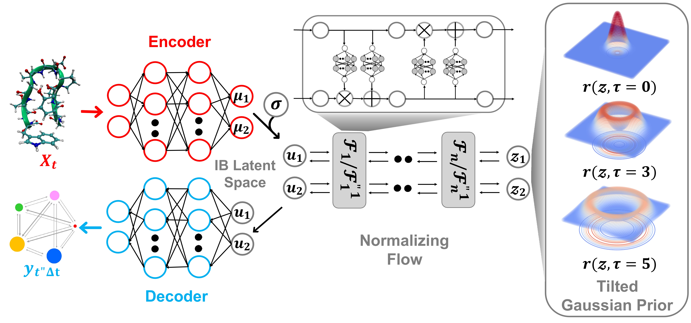

# Latent Thermodynamic Flows (LaTF)

### Abstract
#### Unified Representation Learning and Generative Modeling of Temperature-Dependent Behaviors from Limited Data
Accurate characterization of the equilibrium distributions of complex molecular systems and their dependence on environmental factors such as temperature is essential for understanding thermodynamic properties and transition mechanisms. Projecting these distributions onto meaningful low-dimensional representations enables interpretability and downstream analysis. Recent advances in generative AI, particularly flow models such as Normalizing Flows (NFs), have shown promise in modeling such distributions, but their scope is limited without tailored representation learning. Here, we introduce Latent Thermodynamic Flows (LaTF), an end-to-end framework that tightly integrates representation learning and generative modeling. LaTF unifies the State Predictive Information Bottleneck (SPIB) with NFs to simultaneously learn low-dimensional latent representations, referred to as Collective Variables (CVs), classify metastable states, and generate equilibrium distributions across temperatures beyond the training data. The two components of representation learning and generative modeling are optimized jointly, ensuring that the learned latent features capture the system’s slow, important degrees of freedom while the generative model accurately reproduces the system’s equilibrium behaviors.

### Illustration

### Demo
Two demonstration examples for training LaTF on the 2D three-hole model potential and the Lennard-Jones particle system are provided in the ``./examples`` directory. The corresponding molecular dynamics training datasets are available under ``./datasets.``

### Bibliography

The preprint describing the Latent Thermodynamic Flows method is:
* Yunrui Qiu, Richard John, Lukas Herron and Pratyush Tiwary, Latent Thermodynamic Flows: Unified Representation Learning and Generative Modeling of Temperature-Dependent Behaviors from Limited Data, arXiv (2025) https://arxiv.org/abs/2507.03174;

SPIB: 
* Dedi Wang and Pratyush Tiwary, State predictive information bottleneck, *J. Chem. Phys.* 154, 134111 (2021), https://doi.org/10.1063/5.0038198